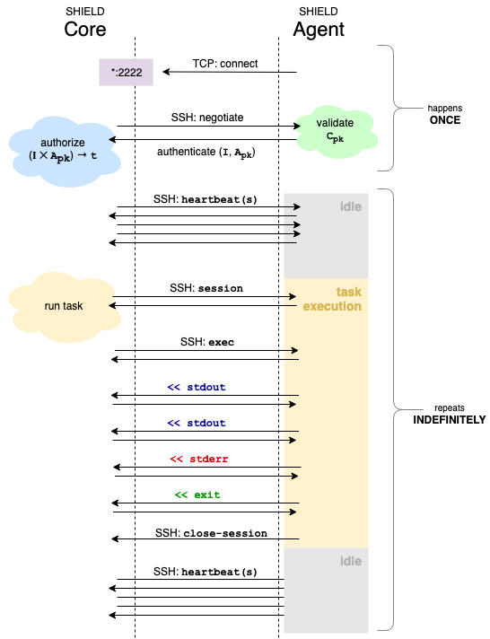
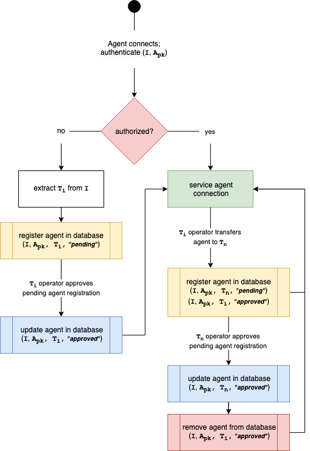
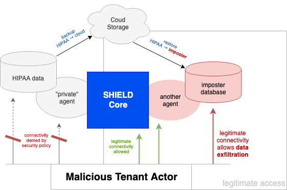

SHIELD Active SSH Fabric : A Proposal
=====================================

This proposal sets forth an active-connection SSH fabric for
SHIELD Agents to communicate with a SHIELD Core, for the purpose
of task execution and status monitoring.

The Problem
-----------

The current method of communication between a SHIELD Core and its
SHIELD Agents is via passive SSH.  Under this scheme, the agent
_passively_ waits for connections from the core.  The core
connects to an agent whenever it needs to remotely execute
something against the agent, and uses "normal" semantics of SSH's
`session` and `exec` primitives to do so.

This method has several drawbacks:

 1. SHIELD Core cannot validate "presence" of an Agent without
    actually trying to connect to the agent.

 2. Mutual Network Visibility is required.  The Agent makes HTTP
    API requests to the SHIELD Core to register, and the Core
    connects back to the Agent on that source IP address.

 3. Intervening NAT devices can make life difficult or impossible
    to operate.  If the SHIELD Agent traverses NAT during
    registration, the core picks up the NAT device's "last leg" as
    the remote peer.  This does not work.

 4. The SHIELD Core initiates the connection using a single
    private key.  This means that all SHIELD Agents have to trust
    (authorize) that key.

 5. The SHIELD Core does not validate the host keys presented by
    the Agents when it connects to them.


The (High-Level) Solution
-------------------------

To fix these shortcomings, we propose flipping the disposition of
the communication.  By having the SHIELD Agents initiate the
connection to the SHIELD Core, we can eliminate problems (2) and
(3).  Since the Agents will be in a position to assert their own
identities (with SSH RSA keys) we can solve (4) and (5).  Since
the Agents will keep an open connection to the Core (facilitated
by SSH heartbeating) the Core can easily verify the "online"
status of any known agent, solving (1).


How It Works
------------

Each Agent will be configured with the following:

  1. A unique identity, i.e. `bob@postgres.ql` (**I**)
  2. An SSH RSA user private key (**A<sub>sk</sub>**)
  3. The address of the SHIELD Core endpoint (**E**)
  4. The public component of the SHIELD Core host key
     (**C<sub>pk</sub>**)

Each SHIELD Core will be configured with the following:

  1. An SSH RSA host private key (**C<sub>sk</sub>**)
  2. An authorization database (**Z**)
  3. A bind address (**B**)

When the SHIELD Core boots up, it will bind **B**, and begin to
listen for inbound SSH protocol connections.  Connecting clients
will be presented with the host key **C<sub>pk</sub>**.

Authorization of clients connecting to **B** will be carried out
against **Z**, which is defined as a mapping of (**I** ✕
**A<sub>pk</sub>**) → **t|f**, where **t** is a successful
authentication.

When the Agent boots up, it will attempt to connect to the SHIELD
Core via **E**.  The host key presented by the remote end will be
verified against **C<sub>pk</sub>** for validity, and if that
succeeds, the agent will attempt to authenticate as **I** using
**A<sub>sk</sub>**.

Here is a diagram that might make this clearer:



An important thing to note in that this proposal explicitly defies
the _conventional_ flow of an SSH conversation; rather than
expecting the client to request a session on the server, and
execute a command in the server's environment, the client waits
for the _server_ (the SHIELD Core) to request a session, and then
handles the subsequent execution request.  To put this into terms
of normal everyday SSH, it's as if you SSH into a server and it
asks to run bash on _your_ laptop.


Agent Registration Workflow
---------------------------

In a perfect world, SHIELD operators would flawlessly and
faithfully whitelist each and every agent that they deploy with
the core they deployed it against.  In reality, we would like to
provide a gentle nudge to make that easier.

Here is a proposed agent registration workflow that leverages the
SSH Authentication Protocol (as defined in [RFC-4252][rfc4252]):



The concept of _ownership_ is central to this workflow.

Ownership of SHIELD Agents (by Tenants) is a new concept we are
trying to introduce to allow zero-trust between tenants in a
SHIELD instance.

Currently (as of v8.4.0), SHIELD Agents are available to all
tenants in a single installation.  This worked fine in the early
days when only a single team interacted with SHIELD, and primarily
used tenancy as a means of namespacing environments.  However, if
one tenant on a SHIELD does not trust another, problems arise.

Suppose for a moment that a SHIELD core is serving two tenants,
one with HIPAA data (Tenant A), and another with an adversarial
desire to access said data (Tenant B).  With global agents, it is
possible for Tenant B to configure a duplicate data system that
they do have access to, and then exfiltrate data by way of SHIELD.



If SHIELD enforces per-tenant access control to each agent,
this whole situation can be avoided.  If "private agent" in the
above diagram was only allowed to be used on jobs controlled and
configured by Tenant A, the exfiltration would fail, and the
malicious actor would have to find a different avenue.

### The Authentication Attempt

First, an Agent has to attempt to authenticate against the SHIELD
Core.  To do this, it provides an identity and uses a private key
to participate in [RFC-4252][rfc4252] SSH Authentication.  The
identity string is not free-form, but rather must conform to the
following grammar:

```
identity  = name [ "/" qualifier ] "@" tenant
name      = token
qualifier = token
tenant    = uuid
token     = ALPHA *( ALPHA / DIGIT / "-" )
uuid      = 8*HEXDIG "-" 3*( 4*HEXDIG "-" ) 12*HEXDIG
```

For example, the agent identity
`postgres1/z1-0@6f332129-5ecb-4695-b6b6-b34b8dc9d669` parses as
follows:

  - `postgres1` is the name of the agent
  - `z1-0` is a qualifier
  - `6f332129-5ecb-4695-b6b6-b34b8dc9d669` is the tenant UUID.

The name component is used to identify the agent in situations
where human operators need to ascertain its purpose, function,
etc.

The qualifier component is used for grouping together logical
clusters of agents who may operate as a unit.  This is aimed
squarely at both the BOSH and Kubernetes use cases, for unifying
key handling and authorization in the face of scaling.

The tenant component identifies the initial tenant for which this
SHIELD agent believes it was deployed.  This is a "bootstrap"
feature that allows an operator deploying SHIELD to target a
single tenant and ensure that agent hijacking does not occur.

When the SHIELD Core processes the authentication attempt, it will
check the internal whitelist for the following, in order:

  1. `$name/$qualifier`
  2. `$name`
  3. `*`

(Note: the tenant UUID is never considered part of the identity
for purpose of authentication.  It will also never be used in any
uniqueness capacity.)


### If Authentication Succeeds

If the SHIELD Core has been told to trust some variation of the
agent identity, a record in the agents table will already exist.

At this point the SSH Core accepts the SSH connection and places
the connected socket descriptor into its internal tables, to wait
until some other part of SHIELD (probably the scheduler) requests
a task be run against the named agent.

### If Authentication Fails

If the SHIELD Core has not been told to trust any variation of the
agent identity (when used in conjunction with the presented key),
it will create a record in the SHIELD database, to register the
agent as:

  - owned by the identified tenant, and
  - pending approval.

This locks in the agent from an ownership standpoint, and ensures
that operators are free to pre-deploy their SHIELD agents before
manually registering the deployed public key.

Until a registered agent has been approved by a Tenant Admin, it
will not be available to Tenant Engineers for use in configuring
data protection jobs.  Pending agents _will_ show up on a new
"Agents" tab in the web interface, from whence they can be
approved with a point and a click.

This registration step fails (leaving no agent record in the
database) if no tenant with the given UUID can be found.

The SSH authentication failure should cause a behaving SHIELD
Agent to re-attempt authentication, but in a backoff loop to
ensure that it does not overwhelm the SHIELD Core in doing so.


### Registration Approval (or Rejection)

The pending agent registration record will exist in the database
until a Tenant Admin comes along and decides to either approve it
or reject it.

When the registration is approved, SHIELD updates the database and
authorizes the stored identity + public key inside of the guts of
the SSH Fabric, awaiting the next authentication attempt from the
remote process (which should then succeed).

When a registration is rejected, it is removed from the SHIELD
database.  This may cause issues if the SHIELD agent is still
running, since the next re-attempt at authentication will just
re-register the agent.  The fix in this scenario is to
decommission the errant agent process.


### Transfer of Agent Ownership

The whole concept of tenancy in SHIELD is a human social
construct: who do we trust, who ought to have rights and
privileges, etc.  Because of that, we expect there to be volatile
and unpredictable change in the composition of SHIELD tenants,
their purposes, and their composition over time.  To remain
flexible in the case of almost certain change, we would like to be
able to transfer the ownership of an agent without redeploying and
reconfiguring it.

This can be done with a two-phase commit approach:

  1. A Tenant Admin on the owning tenant initiates a transfer to
     the gaining tenant.

  2. A Tenant Admin on the gaining tenant approves the pending
     (re-)registration of the agent under its ownership.

This ensures that no agent is transferred without explicit
approval of both parties; the owning tenant gives that approval by
starting the transfer process and the gaining tenant gives it
directly.

Before an agent can be transfered, it will need to be dissociated
from aall job configurations under the current owner.  This action
can piggyback on the "agent hiding" feature, by changing the agent
approval status from _approved_ to _hidden_.  Since it is already
impossible to hide an agent that is in-use, and a hidden agent
cannot be used in new job configurations, these protections are
sufficient to ensure that the agent is unencumbered by obligations
during the ownership transfer.

While an agent is being transfered between tenants, it will have
two registrations: one pending (on the gaining tenant) and one
hidden (on the owning tenant).  As soon as the transfer is
approved by the gaining tenant, the previous registration will be
deleted, and the pending registration upgraded to _approved_.

Should a gaining tenant reject the transfered agent, the pending
registration can simply be remoed from the database.  The _hidden_
registration will remain as such, should the Tenant Admin wish to
try to transfer the agent again.


Core API /v2/ Changes
---------------------

This proposal entails non-trivial (but backwards-compatible) API
changes, which we detail in this section.

### `GET /v2/tenants/:uuid/agents`

Retrieves a list of all agents currently available for use by the
given Tenant.

Filtering should allow the separation of pending, hidden, and approved agents.

Requires Tenant Engineer privileges, or higher.

Response payload should be similar to `GET /v2/agents`.


### `GET /v2/tenants/:uuid/agent/:id`

Retrieves a single agent, with additional metadata.  Only agents
that are available to the given Tenant will be returned.  All
others must return _HTTP 404 Not Found_ responses.

Requires Tenant Engineer privileges, or higher.

Response payload should be similar to `GET /v2/agents`.


### `PATCH /v2/tenants/:uuid/agents/:id`

Allows Tenant Admins to set modifiable attributes about the agent,
including: its approval status (pending → approved), and its
visibility to Tenant Engineers (visible → hidden, and back again).

If we decide to allow agent annotations (not a bad idea) this is
the endpoint that would handle that.

Requires Tenant Admin privileges.

Request payloads look like this:

```
{"approved":true}
```

and

```
{"hidden":false}
```

etc.


### `POST /v2/tenants/:uuid/agents/:id/transfer`

Allows Tenant Admins to transfer an agent to another Tenant.

Requires Tenant Admin privileges.

Request payloads look like this:

```
{
  "to": "other-tenant-uuid"
}
```

Validations include:

  - The agent must exist on this tenant (otherwise we 404)
  - The destination tenant must exist
  - The agent has no outstanding Job obligations

Should validation succeed, the following will happen inside of the
database:

  - A new Agent registration record will be created for the
    gaining tenant.
  - The existing Agent registration will be set to _hidden_


### `POST /v2/tenants/:uuid/agents/:id/(hide|show)`

Allows Tenant Admins to hide or show an agent.  A hidden agent can
only be shown if it is not currently undergoing a transfer.  A
visible agent can only be hidden if it is not currently in use in
a Job configuration.

Requires Tenant Admin privileges.

Request payloads are ignored.


### Existing `/v2/agents/*` Endpoints

Existing endpoints will continue to function, but will only be
able to operate on legacy agent records.  If the SHIELD Core has
disabled legacy agents, these endpoints will continue to function
as though there are no agents.

When the passive fabric is removed outright (targeting 8.8.x /
8.9.x timeframe, assuming this makes it into 8.5.x), these API
endpoints will also be removed, breaking pre-8.5 SHIELD CLI
binaries.


Migrating to Tenant Ownership of Agents
---------------------------------------

TBD


The State of Legacy Agents Post-Implementation
----------------------------------------------

TBD


[rfc4252]: https://tools.ietf.org/html/rfc4252
